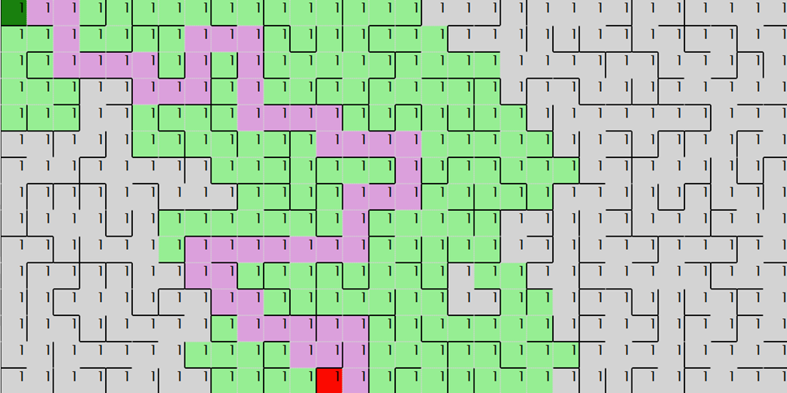

#DSA eksamen: Maze Generation and Pathfinding
Vinter 2024/2025
Lavet af Christian Bindholt

 
Github repository: https://github.com/Bindholt/dsa-eksamen/ 
Deployet udgave: https://bindholt.github.io/dsa-eksamen/

##Maze Generation and Pathfinding
Jeg har lavet en grid-repræsenteret visualisering af labyrint generation og løsning af labyrinter. 
Man kan angive hvor mange rækker (Rows), og kolonner (Columns) ens labyrint skal fylde, og efter at trykke på ”Generate Maze” knappen, vil den generere  en tilfældig labyrint ved hjælp af Wilson’s Algorithm.
Når den har lavet labyrinten, placerer den en start til labyrinten, og et mål.
Herfra kan man vælge at løse labyrinten med enten A* (A-star), eller BFS (Breadth-First Search), som vil vise hvilke celler de leder igennem, ved at farve cellerne grønne, og derefter farve den bedste rute til målet med lyserød.
Man kan se hvor meget de respektive algoritmer har udforsket ved at kigge på ”exploration cost” i venstre side.
Imens algoritmerne kører, kan kontrolpanelet over labyrinten benyttes til at styre afspilningen af algoritmerne. 
Der kan pauses undervejs med ⏯️-knappen, og når man har sat algoritmen på pause, kan man gå et enkelt skridt frem i algoritmen ved at trykke på ➡️-knappen. 
Man kan også ændre hastigheden ved at trykke på ⏪-knappen for at sætte hastigheden ned, eller ⏩-knappen for at sætte hastigheden op.
